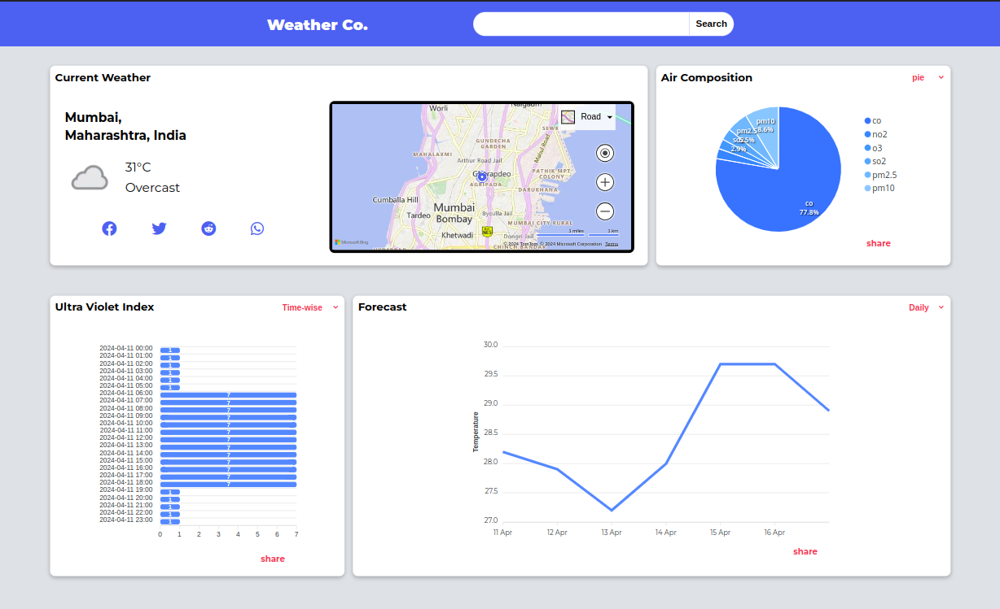
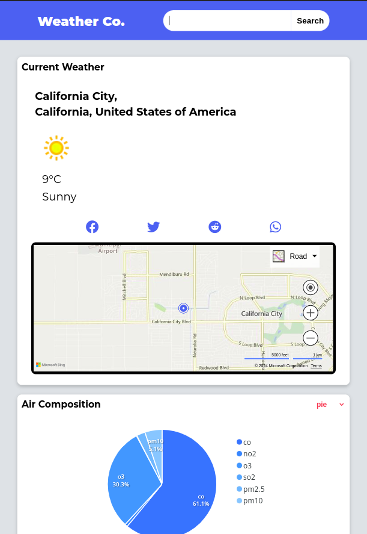
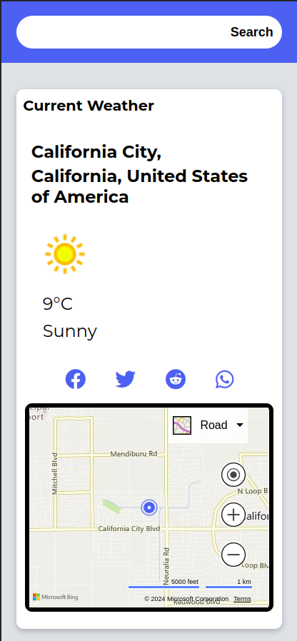
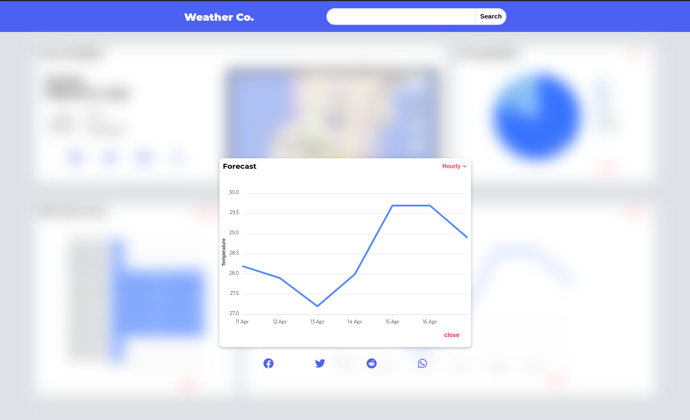

# ☀️ Weather Co.

Welcome to **Weather Co.**! This is a front-end application built with React that provides real-time weather updates and forecasts. With Weather Co, you can stay informed about the current weather conditions and future forecasts in your desired location.

## 🛠️ Technologies and Libraries Used

- **React**: The core JavaScript library for building the front-end application.
- **React Router**: For navigation and routing within the application.
- **ApexCharts.js**: For visualizing data with interactive charts.
- **Bing Map API**: For implementing the interactive map functionality.
- **Weather API & openWeather API**: Provides real-time weather data and forecasts. 
- **Geo-Location API**: Helps to fetch user location data using browser.
- **CSS**: For styling the application with a mobile-first approach.

These technologies and libraries were chosen to build a modern, fast, and user-friendly application. They work together to deliver a seamless weather experience to the users of Weather Co.

## 🚀 Features

- **Real-time Weather**: Get the latest weather updates for your current location or any other location around the world.
- **Forecast**: Comprehensive forecast on both daily and hourly basis displayed using a smooth Line-Chart.
- **Air Composition**: A pie/donut chart making you familiar with your area's oxygen and other gaseous content.
- **Ultra Violet Index**: Bar-Chart displaying UV index of your location on an hourly bases which could be easily sorted for your needs.
- **Social Media sharing**: Share different climatic data visualizations of your location on different social media platforms such as Facebook, Reddit, Twitter and Whatsapp.
- **Responsive Layout**: Responsive to all screen sizes ranging from keypad-phone screens to ultra wide screens
- **Search Locations**: Easily search for multiple locations to get weather updates.
- **Interactive Map**: Explore the map to see conditions in different areas.
- **User-Friendly Interface**: Enjoy a visually appealing and intuitive design.

## 📸 Screenshots









## 💻 Installation

To set up the project on your local machine, follow these steps:

1. **Clone the repository**:
    ```shell
    git clone https://github.com/architbaurai/gdsc-task.git
    ```
2. **Navigate to the project directory**:
    ```shell
    cd gdsc-task
    ```
3. **Install dependencies**:
    ```shell
    npm install
    ```
4. **Start the development server**:
    ```shell
    npm start
    ```

Your application should now be running on `http://localhost:3000`.

---

Thank you for checking out Weather Co! Enjoy the app and stay weather-savvy! 🌦️